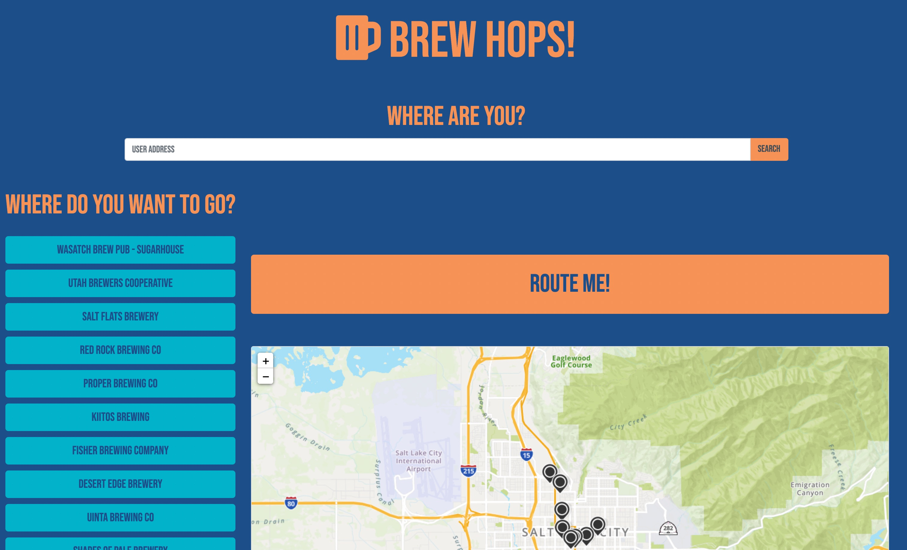

# Brew Hops!
## Description
Brew Hops! Is an interactive map and directory created to help you find the best route between breweries in Salt Lake City. Whether you’re a visitor or a local, this app will help you sample Salt Lake’s finest craft beer selection while keeping you safe and speedy.

We were motivated to create a web application to find a route between breweries by the annual event ‘Utah Ale Trail’. We would like to find the easiest route between breweries so that multiple locations could be visited within a few days with ease and safety. We could then fully participate in the Utah Ale Trail and win prizes and merchandise.

We both learned a lot about actually implementing the languages we’ve learned so far including Bootstrap, JQuery, JavaScript, HTML, and CSS.
Working with the API documentation was challenging but we both feel more capable to read, use, and work with very different sorts of API’s.
We are proud of the way it looks and functions. It’s a fun app!

## Usage
When visiting the Brew Hops! Website the user is presented with a list of the breweries on the left along with a marker for each brewery on the map located on the right of the page. The user inputs their current address in the top input bar and then selects the breweries they would like to visit. The map then populates a route beginning at the user’s starting point. 
    
## Credits
Jason Wisniewski - https://github.com/JasonWisniewski
Sabriel Gee - https://github.com/sabrielg
## License
MIT License

Copyright (c) 2021 Sabriel Gee

Permission is hereby granted, free of charge, to any person obtaining a copy of this software and associated documentation files (the "Software"), to deal in the Software without restriction, including without limitation the rights to use, copy, modify, merge, publish, distribute, sublicense, and/or sell copies of the Software, and to permit persons to whom the Software is furnished to do so, subject to the following conditions:

The above copyright notice and this permission notice shall be included in all copies or substantial portions of the Software.

THE SOFTWARE IS PROVIDED "AS IS", WITHOUT WARRANTY OF ANY KIND, EXPRESS OR IMPLIED, INCLUDING BUT NOT LIMITED TO THE WARRANTIES OF MERCHANTABILITY, FITNESS FOR A PARTICULAR PURPOSE AND NONINFRINGEMENT. IN NO EVENT SHALL THE AUTHORS OR COPYRIGHT HOLDERS BE LIABLE FOR ANY CLAIM, DAMAGES OR OTHER LIABILITY, WHETHER IN AN ACTION OF CONTRACT, TORT OR OTHERWISE, ARISING FROM, OUT OF OR IN CONNECTION WITH THE SOFTWARE OR THE USE OR OTHER DEALINGS IN THE SOFTWARE.
